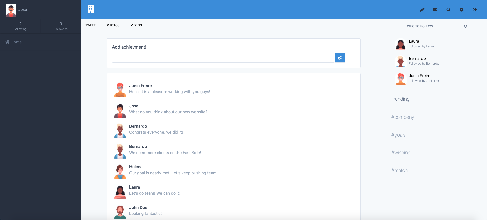

# Company Feed


> This project is a platfom where their employees can post achievments, updates and news about their work and company. 

## Screenshot



## Live Demo

🔗 [Live Demo Link](https://company-feed.herokuapp.com/)

## Description

This project was a built as final capstone for the Ruby on Rails module in the Microverse course, we followed specific guidelines of which functionalities and specifications should be achieved. Right now this app is an MVP where the user is able to add a profile picture, a cover photo, follow and unfollow users and also post their opinions.

## Built With 🛠

```
- Ruby
- Ruby on Rails
- Devise for authentication
- ActiveStorage and AWS S3 to store photos
- Postgres
- Tailwind CSS
```

## Install ⏳

> Follow these steps below to get my application working

1. - [ ] Git clone or download this repo to your machine
2. - [ ] Inside the `company-feed` folder run `bundle install`
3. - [ ] Run `rails db:create` to create the database
4. - [ ] Run `rails db:migrate` to run the migrations
5. - [ ] Run `rails server`
6. - [ ] Visit `localhost:3000` to see the application in action

### Deployment

1. Create an account in heroku;
2. Inside the project folder run `heroku create`
3. Push the code to heroku `git push heroku main`
4. Migrate your database `heroku run rake db:migrate`
5. Visit your application `heroku open`

## Testing ⏳

Run `rspec` to run the tests

## Author

### 👨‍💻 Diego Lira
[](https://github.com/lirad) <br>
[](https://www.linkedin.com/in/diegoalira/) <br>
[](mailto:diegoalira@gmail.com) <br>


### 🤝 Contributing

Contributions, issues and feature requests are welcome!

Feel free to check the [issues page](enter issues url here).

## Acknowledgements

[https://www.behance.net/gallery/14286087/Twitter-Redesign-of-UI-details](https://www.behance.net/gallery/14286087/Twitter-Redesign-of-UI-details)

Design idea by [Gregoire Vella on Behance](https://www.behance.net/gregoirevella)

### Show your support

Give a ⭐️ if you like this project!

### License


